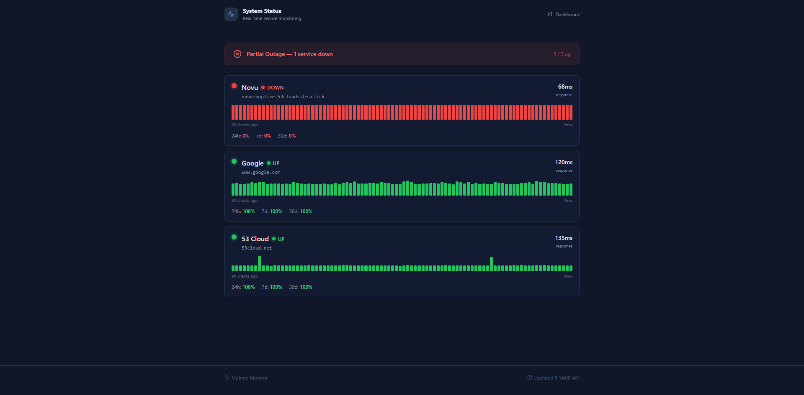

# Uptime Monitor

A lightweight, **self-hosted uptime monitoring tool** built with Nuxt 3. Track HTTP and TCP services, visualize response times, and receive instant alerts on Discord, Slack, or Telegram when a service goes down or recovers.

> **Self-hosted** · **No subscription** · **Zero cloud dependency** · **SQLite storage**



---

## Features

- **HTTP & TCP monitoring** — check any web endpoint or raw TCP port
- **Public status page** — shareable `/status` page with uptime percentages (24h / 7d / 30d)
- **Real-time dashboard** — auto-refreshes every 30 seconds with live response-time charts and uptime bars
- **Alert notifications** — Discord webhooks, Slack webhooks, Telegram bot, or any generic HTTP webhook
- **Configurable intervals** — per-monitor check intervals from 30 seconds to 1 hour
- **Session-based auth** — single admin account with secure cookie sessions
- **Database backups** — one-command timestamped SQLite backups

---

## Tech Stack

| Layer | Technology |
|---|---|
| Framework | [Nuxt 3](https://nuxt.com) (SPA mode, SSR disabled) |
| Server | Nitro (built into Nuxt) |
| Database | SQLite via [better-sqlite3](https://github.com/WiseLibs/better-sqlite3) |
| ORM | [Drizzle ORM](https://orm.drizzle.team) |
| UI | [shadcn-vue](https://www.shadcn-vue.com) + [Tailwind CSS](https://tailwindcss.com) |
| State | [Pinia](https://pinia.vuejs.org) |

---

## Getting Started

### Prerequisites

- Node.js 18+
- Yarn (recommended) or npm

### Installation

```bash
# 1. Clone the repository
git clone https://github.com/makaraphuoy/uptime-monitor.git
cd uptime-monitor

# 2. Install dependencies
yarn install

# 3. Start the development server
yarn dev
```

Open `http://localhost:3000`. On first run the database is created automatically and an admin account is seeded.

**Default credentials:** `admin` / `admin`

### Environment Variables

| Variable | Default | Description |
|---|---|---|
| `ADMIN_USERNAME` | `admin` | Admin username (only used on first boot when no users exist) |
| `ADMIN_PASSWORD` | `admin` | Admin password (only used on first boot) |
| `DATA_DIR` | `./data` | Absolute path where `sqlite.db` and `settings.json` are stored |

> Set `DATA_DIR` to an absolute path in production to ensure the database location never changes.

### Production Deployment

```bash
# Recommended: backup DB + run migrations + build
yarn build:safe

# Start the production server (port 4004)
yarn start
```

Or run the steps separately:

```bash
yarn db:backup     # Snapshot the current database
yarn db:migrate    # Apply any pending schema migrations
yarn build         # Build the Nuxt app
yarn start         # Start on port 4004
```

---

## Project Structure

```
uptime-monitor/
├── pages/
│   ├── index.vue           # Protected dashboard (monitor list + stats)
│   ├── login.vue           # Login page
│   ├── status.vue          # Public status page (no auth required)
│   ├── settings.vue        # Notification & interval settings
│   └── monitor/[id].vue    # Individual monitor detail view
│
├── components/
│   ├── MonitorCard.vue     # Monitor row with uptime bar and actions
│   ├── MonitorFormModal.vue# Add / edit monitor dialog
│   ├── ResponseTimeChart.vue
│   ├── StatusBadge.vue
│   ├── UptimeBar.vue       # 90-block visual heartbeat history bar
│   └── ui/                 # shadcn-vue primitives (Button, Card, Input…)
│
├── stores/
│   ├── auth.ts             # Pinia store — current user, login/logout
│   └── monitors.ts         # Pinia store — monitor list, CRUD actions
│
├── composables/
│   ├── useMonitorStats.ts  # Uptime % calculation helpers
│   └── useSidebar.ts
│
├── middleware/
│   └── auth.global.ts      # Route guard — redirects unauthenticated users to /login
│
├── server/
│   ├── api/
│   │   ├── auth/           # login, logout, me
│   │   ├── monitors/       # CRUD + heartbeat history
│   │   ├── public/         # Unauthenticated endpoints for /status page
│   │   ├── settings.get.ts
│   │   ├── settings.put.ts
│   │   └── health.get.ts
│   ├── db/
│   │   ├── schema.ts       # Drizzle schema (users, sessions, monitors, heartbeats)
│   │   └── index.ts        # DB init, table bootstrap, admin seed
│   ├── middleware/
│   │   └── auth.ts         # API route guard — protects all /api/ except public paths
│   ├── plugins/
│   │   └── scheduler.ts    # Nitro plugin — per-monitor setInterval scheduler
│   └── utils/
│       ├── auth.ts         # Password hashing (scrypt), session management
│       ├── checker.ts      # HTTP and TCP probe logic
│       ├── notify.ts       # Discord / Slack / Telegram / Generic webhook delivery
│       └── settings.ts     # Read/write data/settings.json
│
├── scripts/
│   ├── backup-db.mjs       # Copies sqlite.db to data/backups/ with a timestamp
│   ├── migrate.mjs         # Runs drizzle-kit migrations
│   └── rollback-db.mjs     # Rolls back the last migration
│
├── data/                   # Runtime data (git-ignored)
│   ├── sqlite.db           # SQLite database
│   ├── settings.json       # App settings (webhook URLs, default interval)
│   └── backups/            # Timestamped database backups
│
├── drizzle/
│   └── migrations/         # Generated SQL migration files
│
├── nuxt.config.ts
├── drizzle.config.ts
└── tailwind.config.ts
```

---

## Adding a Monitor

1. Log in at `/` with your admin credentials.
2. Click **Add Monitor**.
3. Fill in the name, URL, type (`http` or `tcp`), check interval, and timeout.
4. For TCP monitors use the format `host:port` or `tcp://host:port`.
5. Set **Visibility** to `public` to include the monitor on the `/status` page.

---

## Notifications

Configure alerts in **Settings** (`/settings`):

| Service | What you need |
|---|---|
| **Telegram** | Bot token from [@BotFather](https://t.me/BotFather) + Chat ID |
| **Discord** | Webhook URL from Server Settings → Integrations → Webhooks |
| **Slack** | Incoming Webhook URL from your Slack app |
| **Generic** | Any URL that accepts `POST` with a JSON body |

An alert fires once when a monitor transitions **up → down** and once when it recovers **down → up**. No repeated pings while the status stays the same.

---

## Database Management

```bash
yarn db:backup    # Create a timestamped backup in data/backups/
yarn db:rollback  # Roll back the last applied migration
yarn db:generate  # Regenerate migration files after editing schema.ts
yarn db:migrate   # Apply pending migrations
```

Heartbeats are automatically pruned to the latest **100 records per monitor** to keep the database small.

---

## Public Status Page

The `/status` route requires no login and displays all monitors with `visibility = public`. It shows:

- Current status (up / down / pending)
- Response time
- 90-heartbeat uptime bar
- Uptime percentages for 24h, 7d, and 30d windows

Share `/status` with your users as a live service health page.

---

## License

MIT
